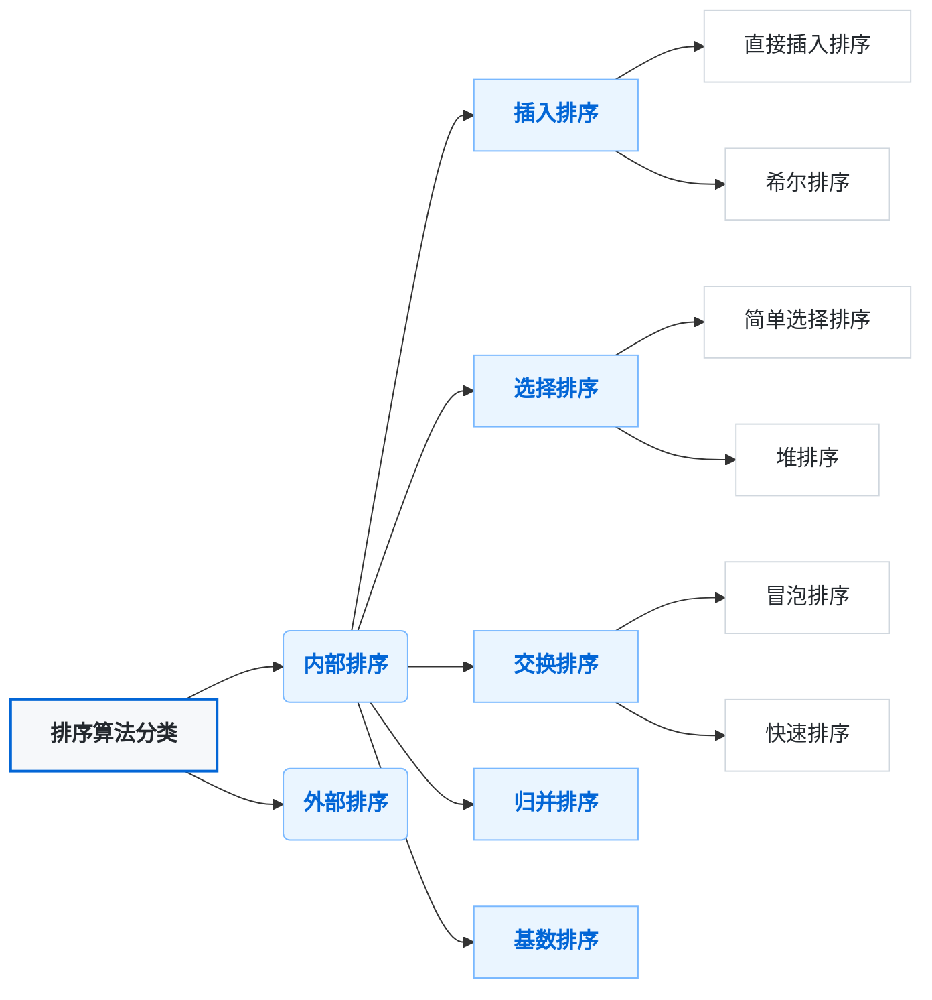

### 排序算法
>含义：将一组数据，以指定的顺序进行排列的过程。

**排序的分类**：由于待排序的记录数量不同，使得排序过程中涉及的存储器不同，可将排序方法分为两大类。 
1. 内部排序：指将需要处理的所有数据都加载到内部存储器中进行排序。
2. 外部排序，数据量过大，无法全部加载到内存中，需要借助外部存储进行排序

**按排序原理分类**:

**排序算法比较**: 

|算法|时间复杂度(平均)|时间复杂度(最坏)|空间复杂度|稳定性|分类|
|:-:|:-:|:-:|:-:|:-:|:-:|
|**冒泡排序**|O(n²)|O(n²)|O(1)|稳定|交换排序|
|**选择排序**|O(n²)|O(n²)|O(1)|不稳定|选择排序|
|**插入排序**|O(n²)|O(n²)|O(1)|稳定|插入排序|
|**希尔排序**|O(n log n)|O(n²)|O(1)|不稳定|插入排序|
|**快速排序**|O(n log n)|O(n²)|O(log n)|不稳定|分治排序|
|**归并排序**|O(n log n)|O(n log n)|O(n)|稳定|分治排序|
|**堆排序**|O(n log n)|O(n log n)|O(1)|不稳定|选择排序|
|**计数排序**|O(n + k)|O(n + k)|O(k)|稳定|分布排序|
|**桶排序**|O(n + k)|O(n²)|O(n + k)|稳定|分布排序|
|**基数排序**|O(d(n + k))|O(d(n + k))|O(n + k)|稳定|分布排序|

